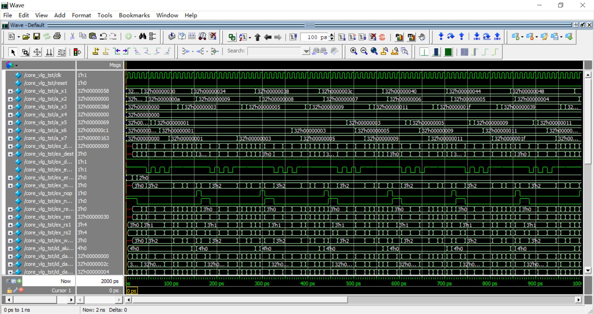

# pipeRV32N
A simple pipelined 32-bit  RISCV core with only  8  base integer registers on FPGA
## Features
- 4-stage RISC-V32 cpu core:
   - IF stage -- instruction fetching
   - ID stage -- instruction decoder
   - EX stage -- execution
   - MEM/WB  -- memory and write back
- Contain only 8 basic core registers
- Support for nearly entire base integer instructions for RISC-V32, except synch, environment and CSR instructions
- No pipeline stalling in JAL instruction
- Maximum 2 pipeline stalling when dealing with JALR，Branch instructions
- Utilize a dual port SRAM as main memory to avoid structural hazard
- IF and MEM/WB stages could make pipeline stalling to wait for data reading/writing to memory, compatible for any kind of memory interface.
## Further Improvement
- Support for interruptions
- Add control statue registers and support for synch, environment and CSR instructions
- Change the dual port SRAM as CPU cache for both instruction and data
- Support for AXI Bus
## Getting Start with pipeRV32N
### Platform 
- win7 or later version
### Software Requirements
- Quartus II
- ModelSim
- Python3
- RISC-V Embedded GCC
### Compile your own RISC-V assembly program
-  Write a RISC-V assembly program, example like ‘main.s’
   - place this assembly program file under 'test' folder
   - Since the maximum size of main memory for pipeRV32N core is 256 Byte, only small assembly program is allowed
   - Please make sure the entry point is labled as  'main'
```
.text
.globl main
main:
	la ra, array
	li sp, 10
loop:
	lw t0, 0(ra)
	lw t1, 4(ra)
	lw t2, 8(ra)
	add gp, t0, t1
	add gp, gp, t2
	sw gp, 12(ra)
	addi ra, ra, 4
	addi sp, sp, -1
	bgtz sp, loop
L2:
	j	L2
.data
array: .word 1,1,1
tmp:   .word 0,0,0,0,0,0,0,0,0,0 
```
-  Open a terminal under 'test' folder and compile the  RISC-V assembly program:
```
riscv-none-embed-gcc.exe -c main.s --specs=nosys.specs -march=rv32i -o main.o
```
-  Link:
```
riscv-none-embed-ld.exe main.o -T .\linker_script.ld  -o main.elf
```
-  Convert it into hex file 'ram.hex':
```
python .\elf2hex.py main.elf 
```
-  Copy this 'ram.hex' file to replace the one under 'src' folder
### Use Quartus to compile and simulate pipeRV32N core
- Create a new Quartus project, setting ModelSim as simulation tool
- Import these files under ‘src’ folder to project:
```
core.v
if_stage.v
id_stage.v
ex_stage.v
wb_mem_stage.v
register_file.v
main_memory.v
ram_element.qip
```
- Set ‘core.v’ as top level entity
- Set ‘test/core_vlg_tst.vt’ as test bench file
- Compile and start simulation
### Simulation result example



